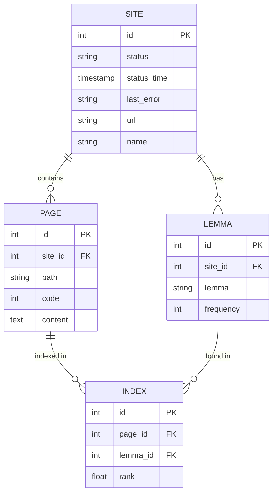

# 🔍 Search Engine

<p align="center">
  
</p>

**Search Engine** — это полноценный локальный поисковый движок, реализованный с нуля. Проект анализирует веб-сайты, извлекает текстовый контент, применяет лемматизацию для морфологического разбора и рассчитывает релевантность страниц. Взаимодействие с движком осуществляется через встроенный веб-интерфейс (Dashboard) и RESTful API.

[](https://github.com/davletchurin/search-engine/actions)


---

## 📺 Демонстрация работы
<p align="center">
  <video src="docs/videos/demo.mp4" width="100%" controls autoplay loop muted></video>
</p>

---

## 🚀 Основные возможности (Features)

* **Многопоточный Web Crawler:** Асинхронный обход и индексация сайтов с использованием `ForkJoinPool` для максимальной производительности.
* **Умный парсинг:** Извлечение чистого текстового контента из HTML-структуры веб-страниц с помощью **Jsoup**.
* **Морфологический анализ:** Нормализация словоформ на русском и английском языках с использованием **Lucene Morphology**.
* **Гибкая настройка:** Вы можете настроить список сайтов для индексации через внешний файл `sites.yml`. По умолчанию для теста там уже преднастроены 2 сайта.
* **Умный поиск и ранжирование:** Вычисление абсолютной и относительной релевантности на основе частоты лемм на страницах.
* **Встроенный Dashboard:** Удобный UI для управления процессами индексации и просмотра статистики.

---

## 🛠 Технологический стек

* **Runtime:** Java 21, Spring Boot 3.5.13
* **Database:** PostgreSQL, Spring Data JPA
* **Parsing & Search:** Jsoup, Apache Lucene Morphology
* **Concurrency:** ForkJoinPool (Java Concurrency)
* **Build Tool:** Maven Wrapper
* **CI/CD & Deployment:** GitHub Actions, Docker, Multi-stage Dockerfile, Docker Compose

---

## 🏗 Архитектура базы данных

В основе поискового движка лежат четыре основные сущности, обеспечивающие связь между сайтами, проиндексированными страницами и найденными леммами:



---

## 🖥 Взаимодействие с интерфейсом

1. **Dashboard** (`/api/statistics`)
   - Отображение общей статистики по всем подключенным сайтам.
   - Детальная статистика и текущий статус по каждому отдельному сайту.
2. **Management** (`/api/startIndexing`, `/api/stopIndexing`, `/api/indexPage`)
   - Инструменты управления движком.
   - Запуск и остановка полной переиндексации.
   - Точечное добавление или обновление отдельной страницы по URL.
3. **Search** (`/api/search`)
   - Тестирование поисковой выдачи с фильтрацией по конкретному сайту.
   - Вывод результатов поиска с подсветкой сниппетов (найденных слов).

---

## 🚦 Инструкция по запуску

[!IMPORTANT]
По умолчанию проект настроен на индексацию тестовых сайтов. Чтобы использовать свои ресурсы, создайте или отредактируйте файл sites.yml в корне проекта перед запуском.

Шаблон для sites.yml:
```yaml
indexing-settings:
  sites:
    - url: https://example.com/       # Обязательно указывайте протокол (http/https)
      name: Название вашего сайта
    - url: https://another-site.ru/
      name: Другой сайт
```

### Запуск через Docker (Рекомендуется)
Для полной сборки и запуска приложения вместе с базой данных (PostgreSQL) выполните:
```bash
docker-compose up -d --build
```
Приложение будут доступны по адресу: **http://localhost:8080/**

### Запуск для разработки (IDE)
1. Поднимите инфраструктуру базы данных:
   ```bash
   docker-compose -f docker-compose.db.yml up -d
   ```
2. Соберите и запустите приложение через Maven:
   ```bash
   ./mvnw clean package -DskipTests
   ./mvnw spring-boot:run
   ```

---

## 🗺 Дорожная карта (Roadmap)
- [x] Реализация многопоточного парсинга HTML.
- [x] Интеграция PostgreSQL.
- [x] Dockerization (Multi-stage build & Docker Compose).
- [x] Настройка CI/CD pipeline (GitHub Actions).
- [ ] Добавление сайтов через интерфейс: Реализация веб-формы и эндпоинта POST /api/site.
- [ ] Интеграция системы миграций Liquibase.
- [ ] Полное покрытие проект тестами.

---
*Проект разработан в учебных целях для демонстрации архитектурных навыков и глубокого понимания алгоритмов работы поисковых систем.*